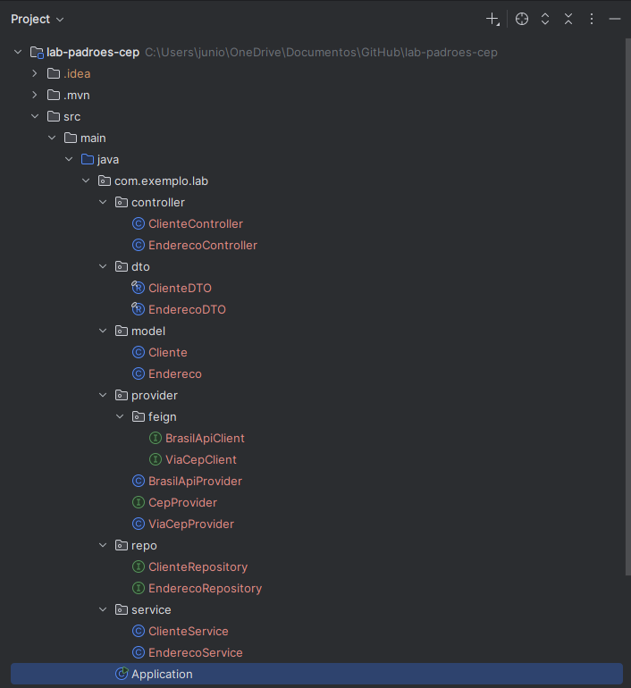
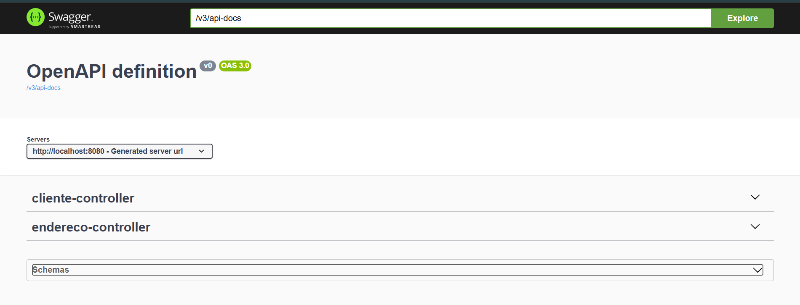
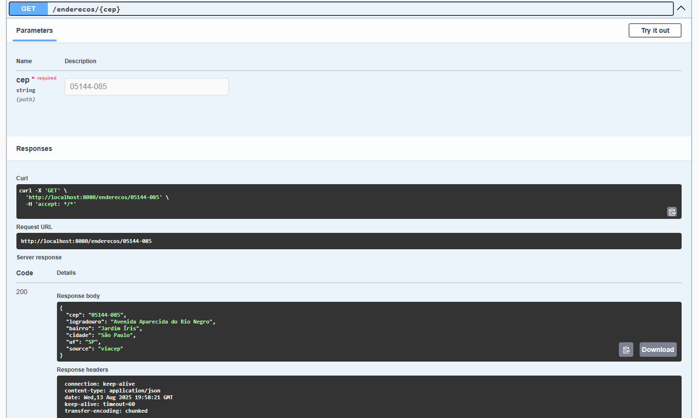
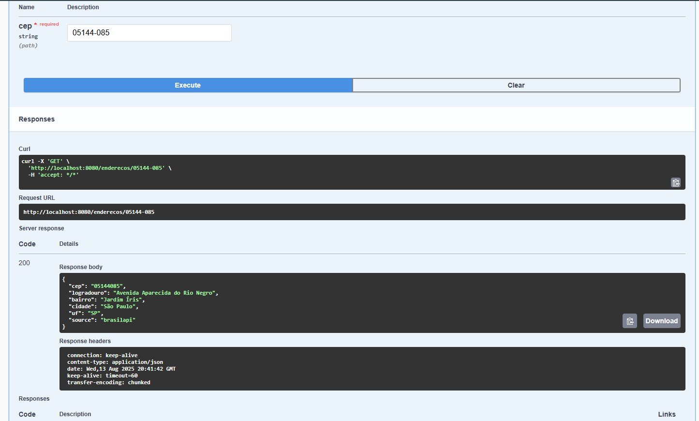
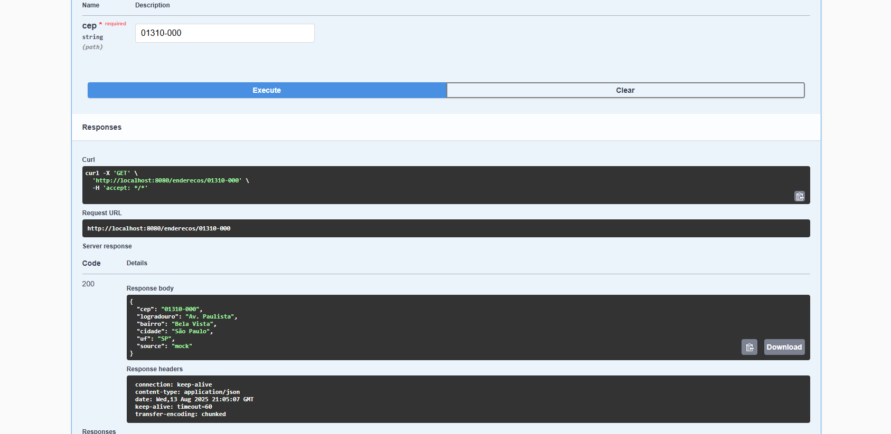
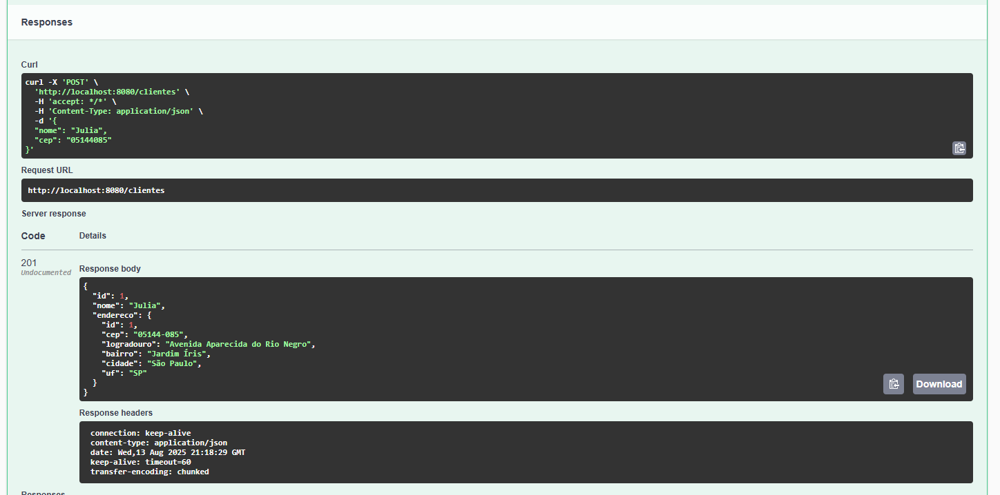
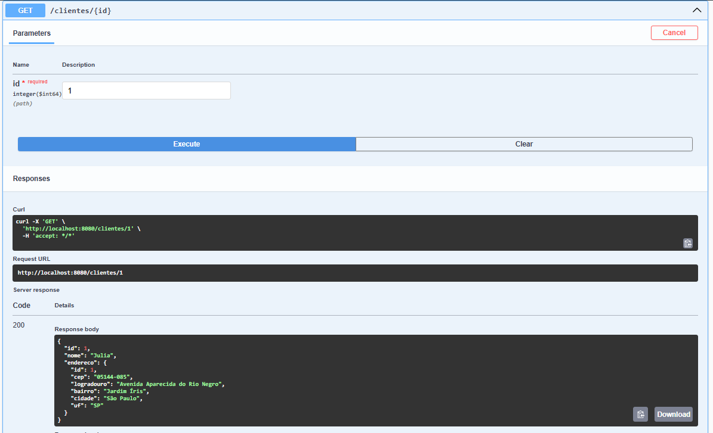
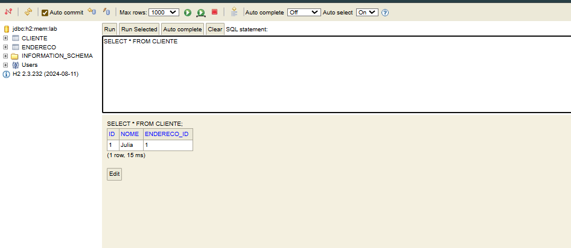

# Lab Padrões de Projeto — CEP Multi-Provedor (Spring Boot)

API REST que cadastra **Clientes** e resolve **Endereços por CEP** aplicando, na prática, três padrões de projeto:

- **Facade** — controllers REST que expõem endpoints simples e escondem a complexidade.
- **Strategy** — múltiplos provedores de CEP com **fallback** (ViaCEP → BrasilAPI → Mock opcional).
- **Singleton** — beans do Spring e **cache** (Caffeine) compartilhado para CEPs.

> **Baseado** no projeto original da DIO: `lab-padroes-projeto-spring`.  
> **Adições** deste trabalho: (1) fallback **multi‑provedor**, (2) **cache Caffeine** via Spring Cache, (3) campo **`source`** no JSON indicando o provedor que respondeu.

---

## Arquitetura e Padrões

- **Facade**
  - `EnderecoController` e `ClienteController` expõem `/enderecos` e `/clientes`.
  - A complexidade (fallback, cache e persistência) fica nas camadas internas.
- **Strategy**
  - Contrato: `CepProvider`.
  - Implementações: `ViaCepProvider` (prioridade 1), `BrasilApiProvider` (prioridade 2) e **`MockCepProvider` (opcional, prioridade 99)**.
  - O `EnderecoService` recebe uma `List<CepProvider>` e tenta **na ordem** definida por `@Order`.
- **Singleton**
  - Beans do Spring são singletons por padrão (controllers, services, repositories).
  - Cache único de endereços com **Caffeine** usando `@Cacheable("enderecos")`.

---

## Tecnologias
Java 21 • Spring Boot 3.5.x • Spring Web • Spring Data JPA • Validation • Spring Cloud OpenFeign • Spring Cache + **Caffeine** • H2 • springdoc-openapi (Swagger UI)

---

## Como Rodar

Pré-requisitos: JDK 21+ e Maven (ou o wrapper `mvnw`).

```bash
./mvnw clean package
./mvnw spring-boot:run
```
Acesse:
- **Swagger UI:** http://localhost:8080/swagger-ui.html
- **H2 Console:** http://localhost:8080/h2-console  
  JDBC URL: `jdbc:h2:mem:lab` • User: `sa` • Password: *(vazio)*

**Config (application.properties) — exemplo**
```
server.port=8080
spring.datasource.url=jdbc:h2:mem:lab;DB_CLOSE_DELAY=-1
spring.datasource.username=sa
spring.datasource.password=
spring.jpa.hibernate.ddl-auto=update
spring.jpa.show-sql=true

spring.h2.console.enabled=true

spring.cache.cache-names=enderecos
spring.cache.caffeine.spec=maximumSize=500,expireAfterWrite=1h

springdoc.api-docs.enabled=true
springdoc.swagger-ui.path=/swagger-ui.html
```

---

## Endpoints

### 1) Resolver Endereço por CEP (Facade + Strategy + Singleton)
**GET** `/enderecos/{cep}`

Exemplo:
```
GET http://localhost:8080/enderecos/01310-000
```
Resposta (exemplo):
```json
{
  "cep": "01310-000",
  "logradouro": "Av. Paulista",
  "bairro": "Bela Vista",
  "cidade": "São Paulo",
  "uf": "SP",
  "source": "viacep"  // ou "brasilapi" ou "mock"
}
```

### 2) Criar Cliente (enriquece com CEP)
**POST** `/clientes`
```json
{
  "nome": "Julia",
  "cep": "01310-000"
}
```
Resposta: `201 Created` com o cliente e endereço vinculado.

### 3) Buscar Cliente
**GET** `/clientes/{id}`

---

## Como Demonstrar o Fallback (BrasilAPI e Mock)

- **Normal:** ViaCEP atende; o campo `source` vem como `viacep`.
- **Fallback BrasilAPI:** se ViaCEP falhar (por exemplo, alterando temporariamente a URL do Feign para forçar erro), a aplicação usa a **BrasilAPI** → `source = brasilapi`.
- **Fallback Mock (opcional):** se ambos falharem, o **MockCepProvider** responde para CEPs conhecidos (ex.: `01310000`) → `source = mock`.

---

## Evidências (prints)

<figure>
  
  <figcaption><b>01 — Estrutura do projeto</b>: pacotes controller, service, repo, model, provider (Strategy) e dto, além da classe Application (Facade visível nos controllers).</figcaption>
</figure>

<figure>
  
  <figcaption><b>02 — Swagger UI</b>: documentação automática dos endpoints /enderecos e /clientes.</figcaption>
</figure>

<figure>
  
  <figcaption><b>03 — CEP resolvido</b>: GET /enderecos/… atendido pelo ViaCEP (campo <code>source</code> = <code>viacep</code>).</figcaption>
</figure>

<figure>
  
  <figcaption><b>04 — Fallback</b>: ViaCEP indisponível → BrasilAPI assume (campo <code>source</code> = <code>brasilapi</code>).</figcaption>
</figure>

<figure>
  
  <figcaption><b>05 — Strategy (ordem)</b>: prioridade dos provedores definida por <code>@Order</code> (ViaCEP &gt; BrasilAPI &gt; Mock).</figcaption>
</figure>

<figure>
  
  <figcaption><b>06 — Criar cliente</b>: POST /clientes com enriquecimento de endereço por CEP.</figcaption>
</figure>

<figure>
  
  <figcaption><b>07 — Consultar cliente</b>: GET /clientes/{id} mostrando persistência e relacionamento com endereço.</figcaption>
</figure>

<figure>
  
  <figcaption><b>08 — H2</b>: dados do cliente na tabela <code>CLIENTE</code> (FK para <code>ENDERECO</code>).</figcaption>
</figure>


---

## Próximas Melhorias
- `@ControllerAdvice` com JSON de erro padrão (validação e 404).
- Validação forte de CEP com `@Pattern`.
- Testes unitários para `EnderecoService` simulando provedores.
- Perfis `dev`/`prod` (ex.: priorizar Mock no dev).
- Rate limiting e retry nos Feigns.

---

## Créditos
Projeto **baseado** no repositório oficial da DIO: **lab-padroes-projeto-spring**.  
Este trabalho adapta o conceito original, adicionando **fallback multi‑provedor**, **cache Caffeine** e o campo **`source`** nas respostas.

---

## Autor & Contatos

**Reginaldo**  
GitHub: https://github.com/reginaldojr-dev  
LinkedIn: https://www.linkedin.com/in/reginaldo-junior-175148188/
